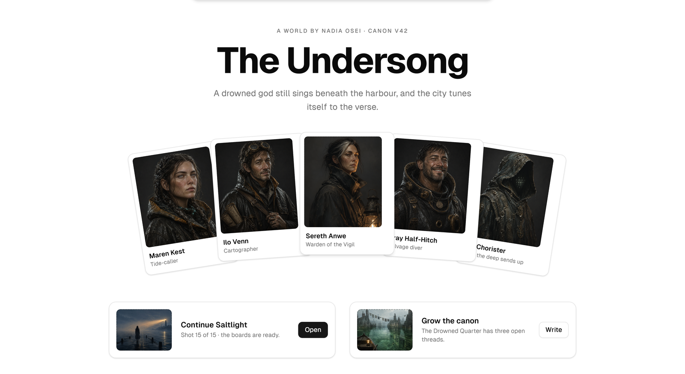
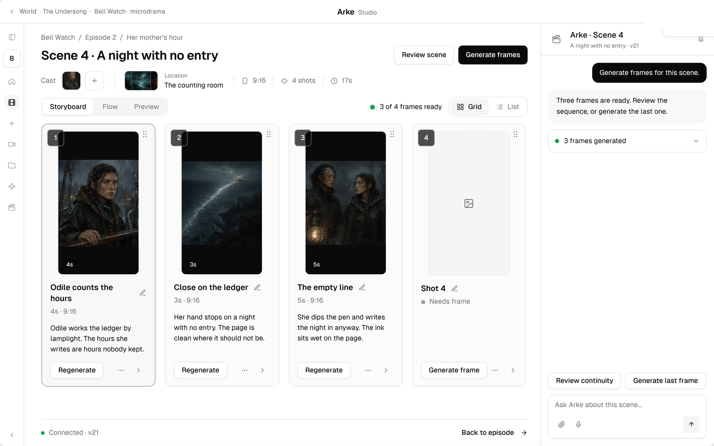
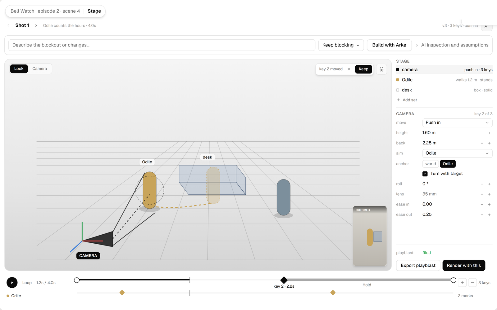
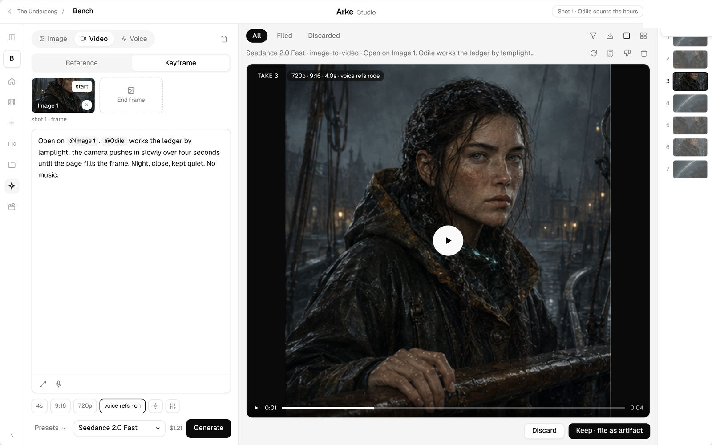
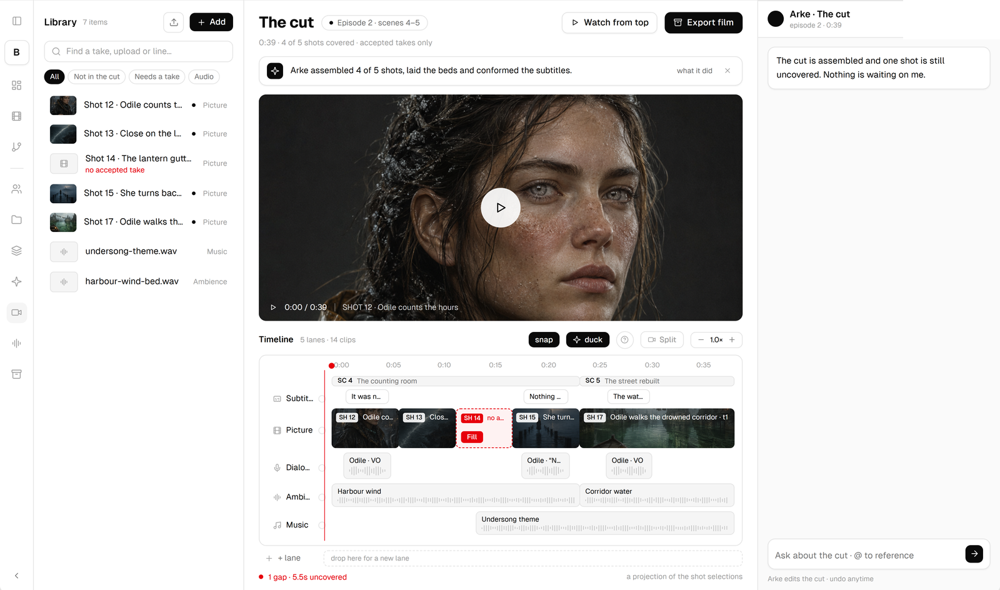
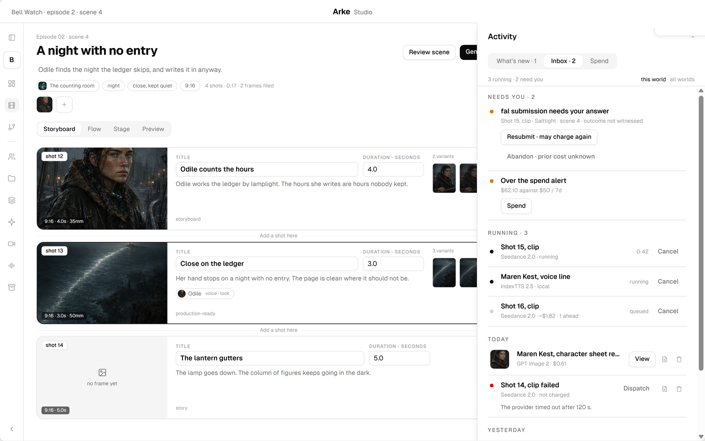
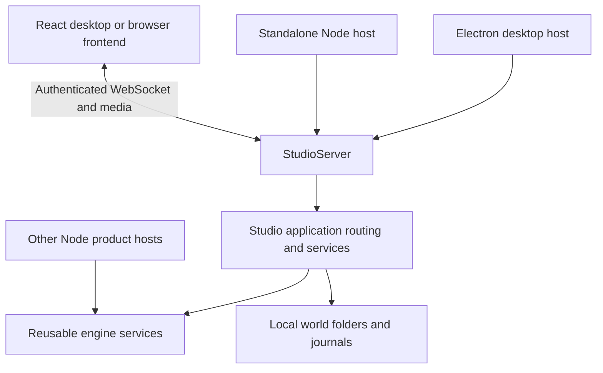

<div align="center">


Build your world once as a durable creative foundation. Every story, film, episode and
interactive experience you make from it draws on the same source and stays consistent
because they share it.

[](https://github.com/michaeljosiah/ArkeStudio/actions/workflows/ci.yml)
[](https://github.com/michaeljosiah/ArkeStudio/releases/latest)
[](LICENSE)

</div>

---

## The idea

Most creative tools are organised around *projects*. You make a short film, and when it's
finished the film is the artefact. The world it was set in exists only in your head and
across a folder of notes.

Arke Studio inverts that. **Your world is the foundation.** Productions — novels, films,
episodes, interactive experiences — are what you develop from it, and a change to a
character lands in all of them.

That inversion is the whole product. Because the world is a real, versioned record rather
than a folder of documents, it can be *consulted*: asked whether something contradicts
what's already true, told what changes when a character does, and cited automatically by
everything it produces.

<div align="center">


*One world, on your disk, at a version. The cast, the canon and the doors back into
whatever you were making from it.*
</div>

## Three mechanics

Everything else is surface.

**1. Authored facts enter through an accept.** Sheet edits, canon entries and scene drafts
arrive as *proposals*. Each is checked against canon, each shows what it would ripple into,
and each waits. Generated takes and operational records land as work happens; acceptance
controls what the authored work cites and uses.

**2. Canon refuses rather than guesses.** The world answers only from what is written, with
a citation per claim. Asked something it cannot support, it says so, cites the closest
entries it has, and offers to open a thread. It never invents behind your back.

**3. Identity travels.** A character is a main photo and one composite sheet. Those two
images follow them into every frame, on every provider that accepts references, so
consistency is structural rather than a function of prompt luck.

## Core concepts

| | |
|---|---|
| **World** | The asset. Holds the cast, the places, the factions, the canon, the tone and the look. |
| **Canon** | What is true. Versioned, typed (rule, lore, timeline, faction, tone), and answerable, including "the canon doesn't know, and won't guess." |
| **Art direction** | The world's visual language: a master look, a style description, a version. Every image inherits it; every exception says where it came from. |
| **Sheet** | A character, location or faction. Versioned, with a voice and an identity kit of two images. Sketch until you lock it. |
| **Production** | A story, film, album or game drawn from the world. Shares the cast and canon by reference. Nothing is copied, nothing is forked. |
| **Scene → Shot → Take** | The unit of work is the shot. Each is its own brief and its own retry. Accepted takes assemble the cut. |
| **Stage** | A shot's camera and blocking, worked out in 3D before you spend on a generation: cast and set placed once per scene, camera keys per shot. |
| **Artifact** | Recordings, documents, references. Filed by provenance, so anything that cited a sheet lands against it automatically. |

## How it works

Every authoring surface in Arke Studio follows one loop:

```
   talk it through  ──▶  a proposal  ──▶  checked against canon  ──▶  accept or discard
                                              │
                                              └── what else this changes, before you decide
```

You describe what you want in your own words, in World Chat. Arke drafts it, tells you
what it checked and what it would ripple into (*"14 reference images predate this change;
scene 4's brief re-renders its cast block; 3 productions pick it up on their next
dispatch"*), and then waits.

**AI-authored changes wait for acceptance.** Jobs, reviews and generated takes exist as
operational records; the gate controls what proposed work becomes committed. Authors can
also save their own chapter edits directly.

## From script to screen

The same loop carries a scene from a written beat to a finished cut, and every stage of it
is a screen you actually work in — not a black box between "generate" and "done."

<div align="center">



**The storyboard writes the shot list with you.** Each shot is its own brief, its own
frame and its own retry. Arke reads the scene and tells you what's still missing — here,
one frame out of four.

<br>



**The Stage blocks the shot before you spend on it.** Cast and set are placed once per
scene; the camera is keyed per shot — height, distance, lens, easing — and previewed as a
playblast. Describe a change in a sentence and Arke rebuilds the camera around it — the
blocking stays put unless you ask it to revise that too — or move the keys yourself.

<br>



**The Bench dispatches with everything attached.** A keyframe, a written prompt, voice
references, the model and its price, all in one row. Every take is kept until you discard
it, so a regenerate is never a gamble on losing what you had.

<br>



**The cut assembles itself from what you've accepted.** One pass places every shot's
picture in script order, conforms the subtitles, and lays an ambience bed under the
scene; dialogue and music are lanes in the same timeline, worked in the same way. Gaps
are called out by name rather than left silent.

<br>



**Nothing runs unwatched.** Every dispatch and every voice line lands in one panel — what
needs your answer, what's running right now with Cancel on every job still stoppable, and
what a failure actually said before you retry it. Spend is tracked against a threshold you
set, and every receipt keeps its estimate's own tilde — nothing is claimed as measured until a
provider actually reports what it charged.

</div>

## What you can make

One world, two production families, all starring the same characters in the same places under the
same rules. Interactive is a Video kind, not a third family:

- **Story** · novels, novellas, short fiction, screenplays and audio-first scripts, drafted with the canon as editor
- **Video** · *Microdrama* (short-form episodic drama), films, music videos, and interactive branching narratives, with boards and shots dispatched to video models with references attached

Visual assets — concept art, character references, storyboards and promotional material — travel
with every production as they develop.

A change to a character lands in all of them.

## Get it

Currently unsigned Windows installers are on the [releases page](https://github.com/michaeljosiah/ArkeStudio/releases/latest).
Windows 11, x64 and ARM64. Free.

First run downloads the local runtimes it needs (Ollama for local text, Kokoro for speech,
Whisper for dictation). Cloud providers are optional and you supply your own keys.

## Principles

**Your world remains yours.** Arke Studio runs on your machine. Worlds live on your disk in
a readable, portable format. Nothing leaves except the generations you explicitly approve.
An account is never required to open, create or continue a world.

**You decide what becomes true.** Arke can propose boldly, but it cannot quietly rewrite
accepted work. Material changes remain visible proposals, shown with what they would disturb,
until you approve them.

**Canon that distinguishes fact from invention.** The world answers from what is written, with
a citation per claim. Asked something it cannot support, it says so, cites the closest entries
it has, and offers to open a thread. It never invents behind your back.

**Choose how and where intelligence runs.** Use local models, bring your own provider accounts,
or choose managed access. Costs remain visible in real currency before anything is spent, tracked
against a threshold you set, and a running job can be cancelled — right up until its result is
already in — from the same panel that watches it. The managed route is a convenience, never the
only easy path.

## How this is built

Arke separates the reusable engine, the Studio application and the host that runs it.
The same Studio server can run inside Electron or as a standalone Node process, with the
React frontend connecting through authenticated WebSocket and media endpoints.



The **engine** exposes a supported Node API for world reads, proposals, portrait generation
and prose authoring, including AI drafting, revision and committed-manuscript output.
It does not start a server. A product host supplies its permissions, persistence and generation
integrations. See [engine services and host contracts](docs/development/engine.md).

The **Studio application** adds Studio's workflows and command routing. Responsibilities are
being extracted into focused services; the Coordinator still orchestrates features that have
not moved yet. **StudioServer** owns transport authentication, listening and connection
shutdown. Desktop supplies native integrations; the standalone Node host supplies local
filesystem persistence. Both use the same application services and lifecycle.

This makes the engine reusable by other products without requiring them to call Studio's
server. The supplied Studio hosts still store worlds in local folders; cloud persistence and
Aonik integration are separate work.

For a first code-reading session, start with [AGENTS.md](AGENTS.md) and the
[developer index](docs/development/README.md): package relationships, workflow traces,
test selection and generated-file ownership.

Arke is specified before it is written. A behaviour is decided in a capability spec — with its
requirements, its design reasoning and its decision log — and only then built. The screens above
are drawn the same way, in a versioned design master, before a line of the screen's own code
exists — which is also where their screenshots come from.

The specification set is not published with the code. It is the design record rather than the
product, and it stays private. That is worth knowing before you read far, because the code cites
it constantly: `SPEC-014 §3` in a comment or a test name is a real reference to a real document,
just not one in this repository. Read those as markers of where a decision was made, not as
dead links.

Two references are read off the source rather than off the specs, and both are here.
[`docs/architecture/`](docs/architecture/index.html) is an illustrated guide to how Arke is built —
the files on disk, the model behind worlds and productions, the accept gate, generation and spend,
and the program itself — written to be readable without a background in code. It explains the
product that exists, which is why it stays public while the specs do not.
[`docs/filesystem-operations.md`](docs/filesystem-operations.md) is the exact list of what each
operation creates, replaces, appends, moves or removes.

| | |
|---|---|
| `packages/contracts` | Zod schemas and the pure judgements the client and coordinator share |
| `packages/engine` | Supported embeddable Node API and optional local adapters |
| `packages/coordinator` | Application services, Studio routing, local persistence, jobs, spend and server host |
| `packages/client` | The React desktop and browser frontend |
| `packages/adapter-opencode` | The writing harness |
| `packages/adapter-claude` | The bring-your-own harness, over the Claude Agent SDK |
| `packages/adapter-arke` | Arke's own local writing harness: an agent loop against Ollama on this machine, running the shared confined tools itself |
| `packages/adapter-codex` | The Codex writing harness |
| `packages/confined-tools` | File and world-query tools confined to a session's folder, shared by harnesses that run tools themselves |
| `packages/providers` | Provider clients and the model manifest |
| `packages/voice` | The Voxa sidecar client |
| `apps/desktop` | The Electron shell that embeds the Studio host and supplies native integrations |
| `design-system` | The prototype, the design template and proposal pages |

## Run from source

Install Node 22.12 or newer, then run `npm ci` from the repository root.
For the desktop app, run `npm start`.

To run Studio without Electron, start the server in one terminal:

```powershell
npm run server -- --root C:\ArkeData
```

In a second terminal, run `npm run dev` and open the private **Arke session** link it prints.
The server uses the supplied local data root; the frontend runs separately. This initial
host serves one local session over loopback. Provider-key storage needs a host-supplied
secure cipher, and native tools need their platform adapters. See the
[standalone server guide](docs/development/standalone-server.md) for configuration and limits.

## Status

**The core loop is built, end to end.** Worlds as folders you own, canon with verified
quotations and typed refusals, proposals staged with ripple computation, reference sets that
travel into every dispatch, real currency shown before spend with running jobs cancellable
from the Activity panel, a shot page carrying its frame, its camera and its 3D Stage together,
and a cut that assembles itself from accepted takes.

**The reusable engine and standalone Node host are available from source.** Desktop and browser
hosts share Studio's application services; the public engine exposes a bounded set of those
capabilities for other Node products.

**Cloud experience is named but not yet connected.** The launch screen already offers "Arke Studio
Cloud — access your worlds anywhere. Sync, collaborate, create" but integration with Aonik
(the platform foundation) is not yet complete.

**The audience journey is incomplete.** Episode creation and episode detail/chat screens have
implementation, but do not yet establish a complete season-production and audience-publishing
workflow. See the [implementation status notes](docs/development/status.md) for evidence and limits.

This repository holds the code and the design system. The product's direction and requirements
live in the specification set, which is not published.

## Contributing

Bug reports, fixes and specification amendments are welcome — see
[CONTRIBUTING.md](CONTRIBUTING.md) for how changes are shaped and tested.

Every contributor signs the [Contributor Licence Agreement](CLA.md) before their first change is
merged. You keep the copyright in your work; the grant is broad enough that the project can ship
it under the AGPL and under commercial terms alongside it. That is how the work is funded, and it
is stated plainly rather than buried.

## Licence

AGPL-3.0-only. See [LICENSE](LICENSE).

You may use, modify and run it, including commercially. If you distribute it, or offer it to
others over a network, AGPL §13 requires you to make your source available to those users under
the same terms. Third-party components and their obligations are recorded in
[THIRD-PARTY-NOTICES.md](THIRD-PARTY-NOTICES.md).
