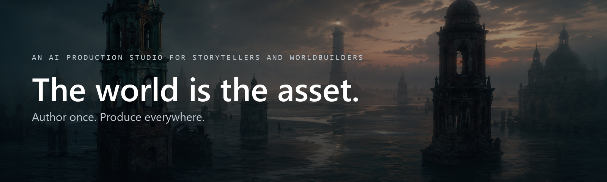

<div align="center">



Invent a character, a place, a rule about how your world works, once. Every book,
film, song and game you make from it draws on the same source, and stays consistent
because they share it.

[](https://github.com/michaeljosiah/ArkeStudio/actions/workflows/ci.yml)
[](https://github.com/michaeljosiah/ArkeStudio/releases/latest)
[](LICENSE)

</div>

---

## The idea

Most creative tools are organised around *projects*. You make a short film, and when it's
finished the film is the artefact — the world it was set in exists only in your head and
across a folder of notes.

Arke Studio inverts that. **The world is the thing you own.** Productions are what you
draw out of it.

That inversion is the whole product. Because the world is a real, versioned record rather
than a folder of documents, it can be *consulted* — asked whether something contradicts
what's already true, told what changes when a character does, and cited automatically by
everything it feeds.

## Core concepts

| | |
|---|---|
| **World** | The asset. Holds the cast, the places, the factions, the canon and the tone. |
| **Canon** | What is true. Versioned, typed (rule, lore, timeline, faction, tone), and answerable — including "the canon doesn't know, and won't guess." |
| **Sheet** | A character, location or faction. Versioned, with a reference kit and a voice. Sketch until you lock it. |
| **Production** | A story, film, album or game drawn from the world. Shares the cast and canon by reference — nothing is copied, nothing is forked. |
| **Scene → Shot → Take** | The unit of work is the shot. Each is its own brief and its own retry. Accepted takes assemble the cut. |
| **Artifact** | Recordings, documents, references. Filed by provenance — anything that cited a sheet lands against it automatically. |

## How it works

Every authoring surface in Arke Studio follows one loop:

```
   talk it through  ──▶  a proposal  ──▶  checked against canon  ──▶  accept or discard
                                              │
                                              └── what else this changes, before you decide
```

You describe what you want in your own words. Arke drafts it, tells you what it checked
and what it would ripple into — *"14 reference images predate this change; scene 4's brief
re-renders its cast block; 3 productions pick it up on their next dispatch"* — and then
waits.

**Nothing becomes real without an accept.** Not a canon entry, not a sheet edit, not a
render. That rule is not a safety feature bolted on the side; it is the shape of the
application.

## What you can make

One world, many formats — all of them starring the same characters, in the same places,
under the same rules:

- **Story** — novels, scripts, serials, drafted with the canon as editor
- **Video** — boards and shots dispatched to video models with references attached
- **Stills** — visual albums, key art, reference kits
- **Game** — branching narrative with a chapter graph, playthrough state and an
  engine-neutral export

A change to a character lands in all of them.

## Principles

**Your worlds stay yours.** Arke Studio runs on your machine. Worlds live on your disk in
a readable format, and nothing leaves except the generations you explicitly approve.

**Your keys, your providers.** Bring your own API keys, or run models locally. What your
machine can't run stays visible and disabled, with the reason.

**The canon never guesses.** Asked something it can't answer, it says so and cites the
closest thing it has. Inventing quietly is worse than admitting a gap.

**Nothing is filed by hand.** Provenance is recorded at dispatch, so artifacts, citations
and usage assemble themselves.

**No lock-in.** Open format, open licence. Leave whenever you like and take the world with
you.

## Status

**Early, and running.** World genesis, canon, cast, reference kits, world art direction and
productions are built; signed Windows installers ship from the releases page. The narrative-game
graph is designed in the prototype and not yet implemented.

This repository holds the code, the specifications and the design system.

## Licence

MIT. See [LICENSE](LICENSE).
