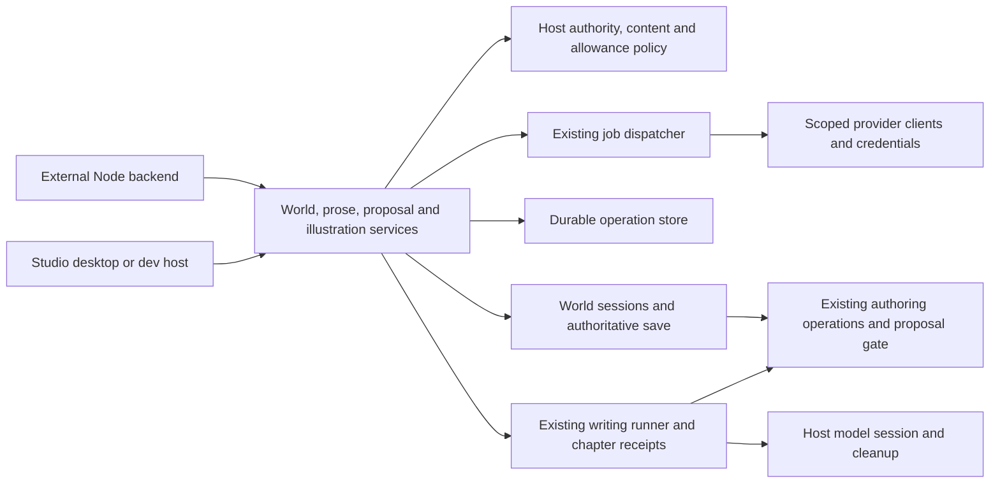

# Embeddable engine services

The engine supports world reads, character proposals and portraits, plus a prose journey: create a Story and chapters, edit text, draft or revise with AI, accept a proposal, and read the committed manuscript. Studio and an external Node host share the existing domain writers, model runner and proposal gate.

The sentence-to-character service still stages a sketch; its harness continuation belongs to Studio. The separate chapter-writing API below runs through an explicit host-provided model runtime.



## Responsibility inventory

| Responsibility | Owner | Remaining limitation |
|---|---|---|
| Settings, secrets, logs, ledger and operation journal construction | `application/studio-composition.ts`, called by `studio-host.ts` | Compatibility Coordinator constructor supplies this composition when omitted |
| Host lifecycle and UI dispatch | Coordinator, desktop main and dev entry | Most commands remain local-only |
| Per-caller world reads and exact media checks | `application/world-sessions.ts` | Host supplies projection and delivery policy; Studio retains its authenticated sole-author transport |
| Sentence proposals, accept/discard and resolution | `application/proposals.ts` | Existing gate owns commits and ripple checks |
| Portrait preparation, reservation and settlement | `application/generation.ts` | Other generation routes remain in their existing modules |
| AI chapter drafting and revision | `application/writing.ts`, `application/local-writing.ts` | Host supplies the model runtime; revisions start from committed prose |
| Committed manuscript Markdown | `application/prose.ts`, `application/local-prose.ts` | Complete readable, nonempty chapters; publishing formats are separate |
| Scoped world lifetime | `application/local-worlds.ts` or host `EngineWorldRepository` | Materialised folders are not distributed authoritative storage |
| Job state and provider recovery | Existing dispatcher with injected `JobStateStore` | Host must preserve credential, landing and ledger contracts |
| Durable request identity | `EngineOperationStore`; flushed local implementation | Local file assumes one process owns it |
| Remaining Coordinator work | Conversations, productions, Stage, audio/video, release, diagnostics, settings and UI events | Future extractions should follow existing domain modules |

## Public package

`@arke-studio/engine` is an ESM Node package, version 0.2.0, requiring Node 22.12 or later. The root exports application services and host contracts. `@arke-studio/engine/local` exports optional folder adapters, filesystem provider, operation journal and existing dispatcher. Neither entry constructs Electron or starts a server.

Build with `npm run build --workspace @arke-studio/engine`; pack with `npm pack --workspace @arke-studio/engine`. Install that tarball into the backend. Do not import coordinator source paths. Registry publication is a separate release action.

The package bundles shared contracts and relevant implementation. Runtime dependencies are Zod and YAML. Native better-sqlite3 is an optional dependency used only by the local filesystem/index adapter. Core-only hosts can install with `--omit=optional`; importing `./local` without SQLite gives an installation diagnostic. Node and SQLite declaration dependencies accompany its types. This is not a browser package. Package separation makes no change to the repository's license.

Consumers should pin a tested version. During 0.x, breaking public contract changes require a minor version bump, consumer tests and migration notes; compatible fixes use a patch version.

## Host construction and authority

Call `createEngine({ worlds, operations, policy, queue, writing })`. The first four dependencies are required; `writing` is optional and enables AI chapter calls. The policy has no permissive fallback. Studio explicitly supplies its sole-author policy.

The host authenticates requests and constructs `EngineContext`: actor, security scope, executor and subject. Never trust these fields because a browser sent them. A scope is an authorization partition, not a world or subscription. Policy must check the relationship between scope, subject, actor and requested world, including revocation, on each call. Proposal decisions carry a proposal ID; portrait requests carry a sheet ID.

`worlds.read` projects a detached bundle for each caller and checks delivery against its hash. Reconnect calls this method again. It does not replay Studio's global snapshot. `worlds.media` checks artifact identity and hashes the returned bytes; approval for an earlier hash does not approve changed bytes. Its optional sheet ID is forwarded to both authorization and delivery checks; the host must validate the artifact belongs to that scope. Hosts must project held/private artifact metadata out of world reads. A successful job is a candidate, not an accepted portrait or child-safe output.

The generation model is host-resolved configuration, not a browser-provided model description or price. Host admission must inspect frozen requests and current allowance. The queue's clients, credential resolution, admission and authoritative artifact landing are host-owned. Credential resolution receives the durable job, including its engine context, on submit and recovery. Operator provider cost remains in the queue ledger; user allowance is a separate reservation and settlement contract.

## Save, retry and shutdown

A repository callback uses the explicitly named world and must retain ownership through the callback. `saved(operationKey)` resolves only after authoritative state is accepted. Uploading to a temporary directory is not a save receipt. The local adapter's optional `finalise` hook returns only an authoritative save acknowledgement and can delay or reject the receipt. Local snapshots, receipts and preconditions consistently use the materialised bundle's content hash. A host that exposes remote revision tokens must implement that consistently in its own world sessions, alongside authoritative restore and fencing.

Revision preconditions run inside the local write gate for propose, accept, discard and illustration preparation. `EngineWorldSession.illustrations` must check its supplied revision and freeze inputs in the same transaction. Accept can additionally bind the draft revision. External session implementations must preserve those semantics. Local ownership checks are not an atomic distributed fence; issue #468 remains a production prerequisite.

Mutation IDs are scoped by security scope, actor and world. Reusing an ID with different input is refused. Completed operations replay after restart, subject to current permission and content checks. A started operation has an uncertain outcome: its side effects cannot be repeated automatically. The host must reconcile durable save, queue and provider evidence before a separate recovery decision. Never delete a started row to make a retry work.

The operation store's insert-if-absent and completion must be durable and atomic across workers. The local journal validates its envelope, action-specific result and immutable record identity, syncs before acknowledging, and fails closed on malformed records or uncertain appends. It is not a distributed database. Keep it with authoritative operational state, separate from disposable caches.

Reconciliation validates the recorded subject and full resource, including its sheet, before delivery or allowance changes. Artifact policy checks retain that sheet identity. A different executor may resume work but cannot substitute another subject.

Portrait reservation precedes enqueue. Interrupted or partially enqueued batches retain their reservation and need reconciliation. Admission results preserve confirmed job IDs, per-request failures and an explicit needsReconciliation flag, including after replay. A completed operation record means the admission result was saved, not that every request succeeded; they cannot release funds while provider work may exist. The existing queue retains persist-before-submit and unknown-provider-outcome recovery. Terminal reconciliation reads every landed artifact and applies delivery policy to its actual bytes. Missing, unreadable or unapproved artifacts hold settlement. The approved artifact IDs and SHA-256 hashes accompany each job in the durable charge/release decision and the host settlement call. Both host calls must be idempotent by operation key, including when their response is lost. Unavailable or refusing output checks hold settlement until policy permits it; they do not release an outstanding reservation. Later policy changes may withhold delivery but cannot reverse an already recorded financial decision. A settled response reports `jobIds` from that durable financial decision and `deliverableJobIds` from the current output checks; those lists can differ. Missing queue evidence before a settlement decision returns `needs-reconciliation`, never perpetual `pending`. Existing settlement decisions can still finish after queue rows are removed.

The filesystem provider serializes world selection and scoped callbacks so navigation cannot close a store still in use. A scoped callback must use its supplied store and must not recursively select or open another world through the same provider.

The host owns queue lifecycle. Stop external admission, stop queue admission, drain or dispose provider work according to the queue contract, call `engine.close()`, then close a shared filesystem provider. Engine close rejects new calls, waits for active service work, drains operation state and closes its repository. It does not dispose a supplied queue. If cleanup fails, another `close()` retries draining and repository cleanup while admission stays closed; host cleanup adapters must be idempotent.

## Validation and remaining work

Coordinator `test/application/engine.test.ts` exercises the real filesystem gate, supplied policy, durable operation state and existing dispatcher: caller isolation, save refusal, duplicate replay, torn state, held bytes, settlement response loss, stale revisions and shutdown. Overlapping batches retain separate operation-keyed landing paths. `test/application/studio-lifecycle.test.ts` checks serialized world opens and failed shutdown after engine closure. Existing gate, ownership, transport and queue suites retain deeper regression coverage.

`npm test --workspace @arke-studio/engine` builds, packs, installs into an OS temporary directory outside the monorepo, executes the journey and typechecks an external consumer. It uses a deterministic provider and requires registry access for declared dependencies. CI runs it on Windows and Linux with the workspace tests. No paid generation is involved.

These tests establish an application boundary and simulated recovery behavior. Production hosts still need authoritative restore/finalisation, atomic fencing (#468), scoped secrets, real content policy, idempotent allowance accounting and operational recovery procedures. Aonik adapters, commercial workflows, monthly scheduling, printing and interactive episodes remain outside this package.

## Coordinator extraction toward a server host (epic #1182)

The first authoring extraction is internal to Studio. It does not expand the public engine API
or establish cloud authorization and storage guarantees.

| Responsibility | New owner | Still supplied by Studio |
|---|---|---|
| Validate conversation context, start/retry a turn, cancel production setup | `application/conversation-authoring.ts` | Authorized open store, cached runner and optional naming pass |
| Assemble writing sessions, leased retrieval, chapter/setup briefs, receipts and validation | `application/conversation-runs.ts` | Harness adapter, session configuration, query endpoint, model/research policy, action adapters and operator notifications |
| Open a prose workspace with its derived records; create/save/edit/restore/retire chapters | `application/prose-authoring.ts` | Authorized open store, request/result events, snapshot sequencing and save draining |

Coordinator keeps runner identity across commands, maps progress and results to Studio events,
and owns shutdown. Existing `world-chat/run.ts` remains the durable turn state machine;
`productions/ops.ts` and the proposal gate retain write and history rules. Direct chapter saves
do not become proposals or cut a new accepted version. Generated chapter proposals still use
the existing explicit acceptance path. The authoring service returns a completion promise so
Studio can publish a running turn before waiting for the model; optional naming never delays
the reply.

Regression baseline: `test/application/conversation-authoring.test.ts` covers the extracted
boundary, scratch/lease cleanup, rejected contexts, chapter grounding and stale-save/reopen
behaviour. Preserve the existing world-chat run, retry, cache, recovery and chapter/proposal
suites. Model quality and production cloud persistence are not demonstrated by these tests.

The extraction established the base for the public authoring contracts and external consumer
proof described below. Further orchestration work should precede consolidating the Studio server host: Electron-managed or standalone Node startup,
using the existing authenticated transport for desktop and browser clients. Kidz embeds the
engine in its own Node server and supplies its private product and Aonik integrations.

### Production creation and permission-card composition

`application/production-creation.ts` now owns the legacy local creation request reservation,
committed-slug lookup and domain creation call. Its commit notification lets Studio publish the
new world before acknowledging success; duplicate admission stays reserved until that callback
finishes. Coordinator maps outcomes to correlated events. The existing creation journal and
request-ID semantics are unchanged: this is not the durable, scoped public authoring API.

`application/conversation-actions.ts` composes the existing permission-card authority adapters
for both live decisions and recovery. Supplied adapters replace a default of the same kind.
The service moves its authority path after archival before notifying the host, preserving
terminal writes in the moved world even when publication fails. Coordinator supplies platform
callbacks and publishes UI state; `arke-actions/lifecycle.ts` remains the sole decision and
recovery state machine. There is no new permission journal or decision protocol.

Regression coverage includes `test/application/production-actions.test.ts`, production creation
acknowledgements, and the existing action lifecycle/coordinator/recovery suites. Production setup
continues to use `productions/setup-command.ts` and its reviewed creation path. The public
authoring contracts below now add scoped durable operations; the server host remains future work under #1182.


## Direct prose authoring (0.2)

`engine.prose` supports creating a Story production, creating a chapter, reading it by its
canonical ID and saving direct author edits. This is the next public boundary under epic #1182.
AI chapter drafting and manuscript output are described below. Outline generation is not part of this API.
Studio's local workspace services and this API share `productions/ops.ts`; Studio transport
and event sequencing retain their existing compatibility services.

```ts
const production = await engine.prose.createProduction(context, worldId, {
  operationId: "story-1", title: "The river path", logline: "A fox finds a way home.",
});
const productionId = production.value.productionId;
const chapter = await engine.prose.createChapter(context, worldId, productionId, {
  operationId: "chapter-1", title: "Home", order: 1,
});
const chapterId = chapter.value.chapterId;
const opened = await engine.prose.readChapter(context, worldId, productionId, chapterId);
const saved = await engine.prose.saveChapter(context, worldId, productionId, chapterId, {
  operationId: "edit-1", body: "Fenn followed the river home.", baseHash: opened.hash,
  expectedRevision: chapter.revision,
});
// Use saved.value.hash as the next edit's base, with a new operationId.
```

Writes return `{ operationKey, revision, value }` after `session.saved` acknowledges authoritative
storage. Production creation returns `productionId`; chapter creation adds `chapterId`; saving
also returns the committed `version` and file `hash`. Reading returns those IDs, title, order,
body, version, file hash and available historical version numbers. It exposes no filenames,
audiobook records or internal workspace paths. Select existing productions/chapters from the
caller's projected `worlds.read` bundle, then use their canonical IDs. Ambiguous duplicate IDs refuse reads and saves even when projection hides a
duplicate. A legacy filename is not
an alternative public chapter identity.

Canonical local reads compare the scanned file hash with the bytes read. If an external edit
has outpaced the scan, the read refuses until the host refreshes or reopens the world; it never
returns an old title/order alongside a new body.

The required save `baseHash` is the `sha256:` file hash returned by a read or successful save.
It protects unseen competing edits. An optional `expectedRevision` protects the whole world;
the local adapter rechecks it after a fresh scan inside the domain write gate. Chapter saves
also recheck production membership, filename identity, retirement and pending chapter proposals
in that gate. Resolve a pending draft before editing directly. Direct edits keep the chapter
version; generated prose must still arrive as a proposal and cut a version on acceptance
(SPEC-012 R-5 and R-58). Saving a chapter does not silently add its story events to world canon.

Titles accept 1–200 characters, loglines up to 2,000, chapter ranks 1–1,000,000 and bodies up to
2,000,000 characters. Public production/chapter IDs use the shared slug schema (at most 80 characters). Chapter order uses
the existing writer: it is at least one past the highest stored chapter rank. Inputs reject
unknown fields. Hosts should translate validated product requests into this small contract.

Mutation IDs and fingerprints use the existing durable operation store. Completed retries return
the original receipt, even after later edits, subject to current authorization and delivery.
Use `readChapter` to fetch current text. A failed authoritative save or uncertain completion
leaves `started` evidence and refuses automatic re-execution, including after restart. The current
conservative implementation also retains started records for domain refusals after admission.
After resolving a known stale base or pending draft, submit a new logical edit with a new ID;
never change input under the old ID or erase uncertain evidence.

### Migrating host adapters from 0.1

- Handle the new `production-create`, `chapter-create` and `chapter-save` authority actions.
  The latter two include `productionId`; saves and chapter reads also include `chapterId`.
  New production creation is authorized at world scope before an ID has been allocated.
- Apply current read authority and exact-content delivery to `production` and `chapter`
  results. Every response, including replay, is checked again. Chapter reads do not run bundle
  projection: the policy must enforce per-chapter visibility and holds itself. Project private
  chapter summaries out of world reads separately. Mutation receipts approve the returned
  metadata, not permission to display a chapter body; read its exact content through `readChapter`.
- Implement optional `EngineWorldSession.prose` to enable these calls. Its mutations must check
  the supplied world revision and chapter eligibility in the same transaction as the write,
  preserve base-hash refusal and direct-edit version semantics, and participate in `saved`.
  The supplied local repository implements it. Hosts without it get an explicit unsupported
  error and their existing world/proposal/illustration services remain available.
- Extend durable operation codecs for the new action-specific receipts and resource IDs.
  The local journal validates them and continues reading 0.1 records. Do not reopen a journal
  containing 0.2 prose operations with a 0.1 engine. Use separate operational stores when testing
  a downgrade; never discard unresolved operations to make an older reader accept the file.

Coordinator `test/application/prose.test.ts` covers the local commit path, canonical IDs,
scoped permissions, exact delivery, stale edits, retirement, pending proposals, save failure,
restart and malformed receipts. The packed external consumer creates, edits, closes/reopens and
replays a prose production alongside its existing character/portrait journey. These tests prove
direct authoring and recovery boundaries.

## AI chapter writing and manuscript output (0.2)

An external host can draft a planned chapter, revise committed prose, review the resulting
proposal and accept it through the same gate as Studio. The supported revision here is a complete
chapter rewrite. It starts from committed text, not from another pending proposal. Accept or
discard that proposal before continuing the review loop; a new call never silently replaces it.
The public API does not yet expose passage selection or conversation history.

A pending proposal targeting that chapter blocks another writing call before the model opens.
The staging gate checks again for a competing proposal that appeared during generation.

```ts
// Add writing: host.openWritingRuntime to createEngine's existing options.
const current = await engine.prose.readChapter(context, worldId, productionId, chapterId);
const snapshot = await engine.worlds.read(context, worldId);
const draft = await engine.writing.draft(context, worldId, productionId, chapterId, {
  operationId: "draft-chapter-1", modelId: "host-approved-model",
  instruction: "Write the planned chapter, ending with the discovery of the bridge.",
  baseHash: current.hash, expectedRevision: snapshot.revision,
});
// Present draft.value.title and draft.value.body for review.
const acceptance = await engine.proposals.accept(context, worldId, draft.value.proposal.id, {
  operationId: "accept-chapter-1",
  expectedDraftRevision: draft.value.proposal.draftRevision,
});
if (acceptance.value.status !== "accepted") {
  // Present the gate's refusal or reconfirmation requirement; do not assume a commit.
}
// To revise, read the current chapter/world again and call writing.revise with new inputs.
const manuscript = await engine.prose.manuscript(context, worldId, productionId);
// manuscript.value.markdown is the complete committed manuscript.
```

The local adapter reuses `WorldChatRunner`, the existing chapter briefing and read receipts,
conversation action preparation, and `ProposalManager`. It creates one durable conversation per
operation. Sources include the chapter plan, the preceding chapter's ending, overview, prose
style, selected world references, projected Bible and the current chapter body. The complete
outline is read with receipts before staging. Source material is labelled as source material.
Only one body/title/draft-status change for the requested chapter is allowed; other generated
actions refuse. No story facts become canon through this call.

Required base hash and world revision reject stale admission. Before dispatch and staging, the
adapter checks current authority, projection and source state again. Staging also fences the
chapter's exact file hash and the existing read observations inside the gate. Changes to the
run's own conversation log do not count as changed story sources. Initial support requires
visibility of the complete target outline, overview and prose style; a partial view refuses
rather than exposing hidden material to satisfy a grounding check.

The optional `writing` factory receives trusted context, resource, operation key, explicit model
ID and an abort signal. It returns a shared `HarnessAdapter`, a private scratch directory,
the resolved session model and input token limit, `createSession` and `close`. The directory
must exist outside all managed worlds. The filesystem provider checks resolved paths against
its world library, archive and directory aliases. Custom local providers must implement
`assertWritingScratch`; writing refuses without that check. The host must enforce
actual harness confinement, disable unrelated tools/network access, use scoped credentials,
honour cancellation and drain subprocesses in `close`. A scratch path alone is not a sandbox.
There is no implicit model substitution or paid-provider default. Concrete Studio harness
assembly still belongs in `harness/v2-launch.ts`.

Open the runtime only after checking and durably reserving any host allowance, keyed by the
operation key. Its `close` records operator usage and drains provider work even on failure.
This is not permission to charge a subscriber: product charging, refunds and held-content
decisions remain host responsibilities. The portrait queue's reservation API is not used for
writing. No Aonik commercial billing implementation is added here.

Add `chapter-draft` to host policy actions and durable operation codecs. Both draft and revision
use that action; mode is part of the request fingerprint. Host-returned proposals must target
the file belonging to the requested canonical chapter, not just its production directory;
the binding is checked again on replay. Writing sessions also supply `review(proposalId)`,
which independently reads the authoritative staged manifest, title and full body. The service
compares these with the run receipt before completion and returns the staged body. Malformed
writing and direct-prose receipts still finalise written state, retain started evidence and
withhold output.
Local finalisation refreshes the owned projection after conversation binding/resolution,
so the next call can use the acknowledged revision. Output carries proposal metadata,
title, body, conversation ID and a grounding hash. Completed replay checks current read and
exact-content delivery again. It returns the original candidate even if it was later accepted
or discarded, while its chapter-to-file binding remains valid; use current world/proposal
state for its present status.

`writing.cancel(context, worldId, operationId)` aborts a matching active call without waiting
behind that world's repository queue. Engine close aborts writing and waits for provider
cleanup and authoritative saves. Cancellation, model failure, uncertain provider outcomes and
failed saves retain started operation evidence; they do not authorize retrying the provider.
The conversation creation event records the operation key for host reconciliation. Failed runs
also finalise their conversation records. This slice has no automatic recovery/resubmission of
an interrupted writing run.

Manuscript output is Markdown from every active chapter, in chapter order. It excludes pending
proposal bodies and refuses empty chapters, ambiguous IDs, denied chapters or a filtered
production. “Committed” includes accepted AI drafts and direct author saves. It does not imply
a separate editorial approval of each human edit. The response carries the world revision and
each included chapter's canonical ID, version and exact file hash. Hashes matter because direct
author saves preserve version numbers. Current authority and final exact-content delivery are
checked before returning the assembled output. DOCX/EPUB publishing and print fulfilment remain
separate services.

Regression coverage: `test/application/writing.test.ts` exercises draft → accept → revise →
accept → manuscript, live duplicate calls, restart, cancellation, shutdown, stale sources,
revocation, held output and failed authoritative saves. The packed external consumer performs
the same journey from a newly created Story using a scripted harness and checks public types.
These are protocol and persistence checks, not evidence of model quality, automatic continuity
planning, Aonik readiness, a server host or the atomic hosted writer fence in #468.
