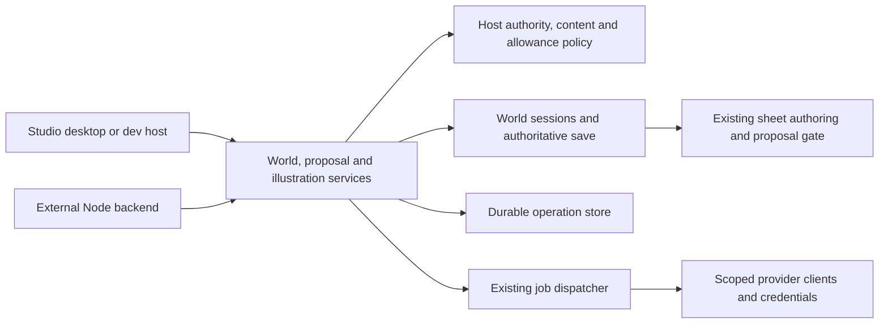

# Embeddable engine foundation

The supported journey is: read a world, propose a character from a sentence, accept or discard the proposal, request a portrait, read a permitted image, reconnect and close. Studio and an external Node host call the same application services. This is the first extraction from Coordinator.

The sentence service stages a sketch using existing sheet authoring. Studio still owns its writing-harness continuation. The public service does not promise to run that harness or produce a finished book.

## Responsibility inventory

| Responsibility | Owner | Remaining limitation |
|---|---|---|
| Settings, secrets, logs, ledger and operation journal construction | `application/studio-composition.ts`, called by `studio-host.ts` | Compatibility Coordinator constructor supplies this composition when omitted |
| Host lifecycle and UI dispatch | Coordinator, desktop main and dev entry | Most commands remain local-only |
| Per-caller world reads and exact media checks | `application/world-sessions.ts` | Host supplies projection and delivery policy; Studio retains its authenticated sole-author transport |
| Sentence proposals, accept/discard and resolution | `application/proposals.ts` | Existing gate owns commits and ripple checks |
| Portrait preparation, reservation and settlement | `application/generation.ts` | Other generation routes remain in their existing modules |
| Scoped world lifetime | `application/local-worlds.ts` or host `EngineWorldRepository` | Materialised folders are not distributed authoritative storage |
| Job state and provider recovery | Existing dispatcher with injected `JobStateStore` | Host must preserve credential, landing and ledger contracts |
| Durable request identity | `EngineOperationStore`; flushed local implementation | Local file assumes one process owns it |
| Remaining Coordinator work | Conversations, productions, Stage, audio/video, release, diagnostics, settings and UI events | Future extractions should follow existing domain modules |

## Public package

`@arke-studio/engine` is an ESM Node package, initially version 0.1.0, requiring Node 22.12 or later. The root exports application services and host contracts. `@arke-studio/engine/local` exports optional folder adapters, filesystem provider, operation journal and existing dispatcher. Neither entry constructs Electron or starts a server.

Build with `npm run build --workspace @arke-studio/engine`; pack with `npm pack --workspace @arke-studio/engine`. Install that tarball into the backend. Do not import coordinator source paths. Registry publication is a separate release action.

The package bundles shared contracts and relevant implementation. Runtime dependencies are Zod and YAML. Native better-sqlite3 is an optional dependency used only by the local filesystem/index adapter. Core-only hosts can install with `--omit=optional`; importing `./local` without SQLite gives an installation diagnostic. Node and SQLite declaration dependencies accompany its types. This is not a browser package. Package separation makes no change to the repository's license.

Consumers should pin a tested version. During 0.x, breaking public contract changes require a minor version bump, consumer tests and migration notes; compatible fixes use a patch version.

## Host construction and authority

Call `createEngine({ worlds, operations, policy, queue })`. All dependencies are required. The policy has no permissive fallback. Studio explicitly supplies its sole-author policy.

The host authenticates requests and constructs `EngineContext`: actor, security scope, executor and subject. Never trust these fields because a browser sent them. A scope is an authorization partition, not a world or subscription. Policy must check the relationship between scope, subject, actor and requested world, including revocation, on each call. Proposal decisions carry a proposal ID; portrait requests carry a sheet ID.

`worlds.read` projects a detached bundle for each caller and checks delivery against its hash. Reconnect calls this method again. It does not replay Studio's global snapshot. `worlds.media` checks artifact identity and hashes the returned bytes; approval for an earlier hash does not approve changed bytes. Hosts must project held/private artifact metadata out of world reads. A successful job is a candidate, not an accepted portrait or child-safe output.

The generation model is host-resolved configuration, not a browser-provided model description or price. Host admission must inspect frozen requests and current allowance. The queue's clients, credential resolution, admission and authoritative artifact landing are host-owned. Credential resolution receives the durable job, including its engine context, on submit and recovery. Operator provider cost remains in the queue ledger; user allowance is a separate reservation and settlement contract.

## Save, retry and shutdown

A repository callback uses the explicitly named world and must retain ownership through the callback. `saved(operationKey)` resolves only after authoritative state is accepted. Uploading to a temporary directory is not a save receipt. The local adapter's optional `finalise` hook can delay or reject that receipt, but a remote adapter must also restore authoritative snapshots and revisions and fence competing writers.

Revision preconditions run inside the local write gate for propose, accept and discard. Accept can additionally bind the draft revision. External session implementations must preserve those semantics. Local ownership checks are not an atomic distributed fence; issue #468 remains a production prerequisite.

Mutation IDs are scoped by security scope, actor and world. Reusing an ID with different input is refused. Completed operations replay after restart, subject to current permission and content checks. A started operation has an uncertain outcome: its side effects cannot be repeated automatically. The host must reconcile durable save, queue and provider evidence before a separate recovery decision. Never delete a started row to make a retry work.

The operation store's insert-if-absent and completion must be durable and atomic across workers. The local journal syncs before acknowledging and fails closed on malformed records or uncertain appends. It is not a distributed database. Keep it with authoritative operational state, separate from disposable caches.

Reconciliation validates the recorded subject and full resource, including its sheet, before delivery or allowance changes. A different executor may resume work but cannot substitute another subject.

Portrait reservation precedes enqueue. Interrupted or partially enqueued batches retain their reservation and need reconciliation. Admission results preserve confirmed job IDs, per-request failures and an explicit needsReconciliation flag, including after replay. A completed operation record means the admission result was saved, not that every request succeeded; they cannot release funds while provider work may exist. The existing queue retains persist-before-submit and unknown-provider-outcome recovery. Terminal reconciliation reads every landed artifact and applies delivery policy to its actual bytes. Missing, unreadable or unapproved artifacts hold settlement. The approved artifact IDs and SHA-256 hashes accompany each job in the durable charge/release decision and the host settlement call. Both host calls must be idempotent by operation key, including when their response is lost. Unavailable or refusing output checks hold settlement until policy permits it; they do not release an outstanding reservation. Later policy changes may withhold delivery but cannot reverse an already recorded financial decision.

The host owns queue lifecycle. Stop external admission, stop queue admission, drain or dispose provider work according to the queue contract, call `engine.close()`, then close a shared filesystem provider. Engine close rejects new calls, waits for active service work, drains operation state and closes its repository. It does not dispose a supplied queue.

## Validation and remaining work

Coordinator `test/application/engine.test.ts` exercises the real filesystem gate, supplied policy, durable operation state and existing dispatcher: caller isolation, save refusal, duplicate replay, torn state, held bytes, settlement response loss, stale revisions and shutdown. Overlapping batches retain separate operation-keyed landing paths. `test/application/studio-lifecycle.test.ts` checks serialized world opens and failed shutdown after engine closure. Existing gate, ownership, transport and queue suites retain deeper regression coverage.

`npm test --workspace @arke-studio/engine` builds, packs, installs into an OS temporary directory outside the monorepo, executes the journey and typechecks an external consumer. It uses a deterministic provider and requires registry access for declared dependencies. CI runs it on Windows and Linux with the workspace tests. No paid generation is involved.

These tests establish an application boundary and simulated recovery behavior. Production hosts still need authoritative restore/finalisation, atomic fencing (#468), scoped secrets, real content policy, idempotent allowance accounting and operational recovery procedures. Aonik adapters, commercial workflows, monthly scheduling, printing and interactive episodes remain outside this package.
