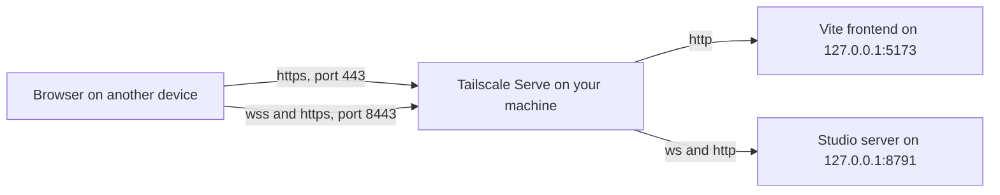

# Opening Studio from another device

You can use the browser frontend from a phone, a tablet or a second computer while Studio runs
on your main machine. [Tailscale Serve](https://tailscale.com/docs/features/tailscale-serve) carries the
connection. This works when you run Studio from source, with the
[standalone server](standalone-server.md) or `dev:coordinator`; the packaged desktop app does not
offer it.

Everything still runs on the main machine: your worlds, the Studio server, the writing assistant
and any local generation. The other device only shows the browser frontend.

## How it fits together



The Studio server never listens beyond loopback. Tailscale Serve listens on your tailnet, adds
HTTPS with your machine's `ts.net` certificate, and forwards to loopback. Only devices on your
tailnet can reach it. Every connection to the server still needs the session capability in the
link Vite prints.

There is deliberately no option to make the server listen on a network address. That would
send the capability over the network unencrypted. Use Serve instead.

## Before you start

- Install Tailscale on the main machine and on the other device, and sign both in to the same
  tailnet.
- In the Tailscale admin console, turn on **MagicDNS** and **HTTPS certificates** (both are on
  the DNS page). Enabling HTTPS publishes your machine names and tailnet name in the public
  Certificate Transparency log; see [Enabling HTTPS](https://tailscale.com/docs/how-to/set-up-https-certificates).
- Find the main machine's tailnet name. In PowerShell:

  ```powershell
  $name = (tailscale status --json | ConvertFrom-Json).Self.DNSName.TrimEnd('.')
  $name   # for example studio.tail1234.ts.net
  ```

The examples below use `$name` for that value. Use the same terminal, or set it again in each
one.

## Start it

**1. Start the Studio server** with the tailnet address as its allowed browser origin:

```powershell
npm run server -- --root C:\ArkeData --origin "https://$name"
```

To use the development coordinator instead, set the origin in its terminal:

```powershell
$env:ARKE_DEV_ORIGIN = "https://$name"
npm run dev:coordinator
```

**2. Publish both ports on your tailnet.** The page goes on 443 and the server on 8443:

```powershell
tailscale serve --bg --https=443 http://127.0.0.1:5173
tailscale serve --bg --https=8443 http://127.0.0.1:8791
tailscale serve status
```

If Serve says it is not enabled for your tailnet, follow the link it prints. `--bg` keeps the
mapping after you close the terminal, and after a restart.

**3. Start the frontend** in a second terminal:

```powershell
$env:VITE_ARKE_WS = "wss://${name}:8443"
$env:ARKE_DEV_LOCAL_WS = "ws://127.0.0.1:8791"
$env:ARKE_DEV_ORIGIN = "https://$name"
npm run dev --workspace @arke-studio/client -- --host 127.0.0.1
```

| Setting | What it is |
|---|---|
| `VITE_ARKE_WS` | Where the other device reaches the server, through Serve. Must be `wss:`. |
| `ARKE_DEV_LOCAL_WS` | The server on this machine that Serve forwards to. Vite reads the session from it. |
| `ARKE_DEV_ORIGIN` | The address the other device opens. Must be `https:` and match the server's `--origin`. |

`--host 127.0.0.1` makes Vite listen on the address Serve forwards to. On some machines
`localhost` resolves only to IPv6, and Serve would find nothing on `127.0.0.1`. Name the
workspace as shown: the root `npm run dev` script does not pass extra arguments on to Vite.

Before printing a link, Vite checks the session through Serve's 8443 mapping. When it succeeds
the terminal shows:

```
Arke session: https://studio.tail1234.ts.net/#/?arke-session=…
```

**4. Open that link on the other device.** The page removes the capability from the address bar
and keeps it only in that browser tab. A new tab needs the link again.

## Keep the link private

Anyone on your tailnet who has the link has full control of the session, the same as you. Don't
paste it into chats or notes.

The link stops working when the server restarts. Restart the frontend as well, and open the new
link it prints.

## Limit who can reach it

Vite does not ask for the capability, so anyone who can reach port 443 on this machine can load
the frontend's pages. Only the client and contracts packages and `node_modules` are served, not
the rest of your checkout.

If your tailnet has only your own devices, there is nothing more to do. If it includes other
people, or this machine is shared with another tailnet, limit the ports to your own devices.
New tailnets let every member reach every device. A policy whose only access rule is this grant
lets each member reach only their own devices:

```json
"grants": [
  { "src": ["autogroup:member"], "dst": ["autogroup:self"], "ip": ["*"] }
]
```

This replaces the default rule that allows everything, so add back any other access you rely
on. See [Tailscale's grant examples](https://tailscale.com/docs/reference/examples/grants).

Never use **Tailscale Funnel** for this. Funnel publishes the port to the whole internet.

## Stop it

Stop the frontend and the server with Ctrl+C, then remove the mappings:

```powershell
tailscale serve reset
```

Otherwise they come back after a restart and point at whatever is next on those ports.

## If it doesn't work

| What you see | What to check |
|---|---|
| `Arke session link not printed: A remote VITE_ARKE_WS must use wss: …` | `VITE_ARKE_WS` must start with `wss://`. |
| `Arke session link not printed: … needs ARKE_DEV_LOCAL_WS …` | Set `ARKE_DEV_LOCAL_WS` to `ws://127.0.0.1:8791`, including the port. |
| `Arke session link not printed: … ARKE_DEV_ORIGIN …` | Set `ARKE_DEV_ORIGIN` to `https://` and your tailnet name. A remote origin also needs the two settings above. |
| `Could not verify the Arke session …` | The server isn't running from this checkout; the 8443 mapping is missing (`tailscale serve status`); or the server's `--origin` doesn't exactly match `ARKE_DEV_ORIGIN`. |
| The browser can't reach the page at all | The 443 mapping is missing, or Vite isn't on `127.0.0.1:5173`. Check `tailscale serve status` and the `--host` flag. |
| Vite shows "Blocked request. This host is not allowed" | Vite was started without all three settings, or with a different name. Restart it with them. |
| **Session link is out of date** | The server restarted. Restart the frontend and open the new link. |
| **Waiting for the coordinator** | The server has stopped, or the 8443 mapping is missing. |
| Pictures and video don't load | The 8443 mapping. Media comes from the server, not from Vite. |
| The console shows `Refused to connect to 'wss://…'` | The page was served without the proxied settings. Restart Vite with all three. |

## What the browser can't do

A few features rely on the desktop app's native bridge and are missing from any browser,
remote or local:

- dropping files onto the window
- stage export
- saving media and copying images
- staging performance audio
- opening the data folder

Provider keys also behave differently. `npm run server` cannot store them securely without a
cipher from its host, and the development coordinator keeps them only until it stops. The
writing assistant and local generation use whatever is installed and signed in on the main
machine.

## Checks this setup is built on

The rules above are enforced in `packages/client/dev-session-plugin.ts` and covered by
`packages/client/test/dev-session-remote.test.ts`. The operational rule is in
[CLAUDE.md](../../CLAUDE.md#the-coordinator-session-is-authenticated-issue-825), and the change
was made in [PR #1297](https://github.com/michaeljosiah/ArkeStudio/pull/1297).
