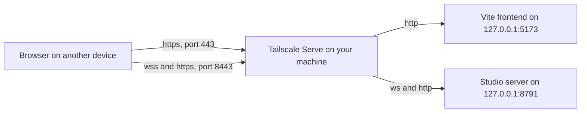

# Opening Studio from another device

You can use the browser frontend from a phone, a tablet or a second computer while Studio runs
on your main machine. [Tailscale Serve](https://tailscale.com/docs/features/tailscale-serve) carries the
connection. The desktop app supports remembered device pairing. The source-run
[standalone server](standalone-server.md) and `dev:coordinator` also retain the development
session-link setup described below.

Everything still runs on the main machine: your worlds, the Studio server, the writing assistant
and any local generation. The other device only shows the browser frontend.

## Everyday access from the desktop app

1. Connect Tailscale on the PC and phone using the same tailnet. Enable MagicDNS and HTTPS
   certificates on the Tailscale admin console's DNS page. Certificate issuance publishes the
   machine's full DNS name in the Certificate Transparency log.
2. In Studio on the PC, open **Settings → Remote access → Enable remote access**. Studio serves
   the built frontend on loopback port 8793 and configures Tailscale Serve's HTTPS port 443.
   An existing mapping on 443 is reported rather than overwritten; stop the older development
   mapping before enabling this mode. Funnel is refused.
3. Open the clean HTTPS address shown in Settings on the phone, then choose **Pair a device**
   on the PC. Enter the code and a device name on the phone. Approve the matching request on
   the PC. Codes work once, expire after five minutes and stop working after five wrong guesses.
4. Bookmark the clean address on the phone. It contains no credential. This browser remains
   authorized for 90 days across browser and Studio restarts. Clearing its site data, expiry,
   or revocation requires pairing again.
5. Optionally enable **Start Studio when I sign in to this PC** in the installed Windows or
   macOS app. Closing the window keeps the host in the system tray; use the tray's **Quit Arke
   Studio** action to stop it. The PC must be awake and signed in. This is not wake-on-LAN or a
   service that starts before user login.

Desktop and phone operate the same coordinator and world session. A paired device has the
owner's ordinary Studio access; pairing management is available only on the PC. Revoke a device
in Settings to stop its active connections and future access. The remote gateway uses a secure,
HttpOnly, same-site cookie; the private process capability never reaches the browser.
Native file selection, dropped host files and desktop-rendered playblasts require the desktop
app. The gateway rejects their host-file commands, including manually supplied filesystem paths.

**Disable remote access** stops hosting, removes only its matching Serve mapping and turns off
automatic startup. Ordinary Quit removes the mapping before releasing the local hosting port;
the next app start recreates it at the same bookmarked address. If Tailscale cannot remove the
mapping, Studio keeps the port reserved and reports that shutdown failed; restore Tailscale
and retry Quit. The built desktop page keeps its existing loopback
policy; only the copy served to the phone gets the remote same-origin policy.
On startup, a stale mapping is withdrawn before the device registry is loaded. If that cleanup
fails, an inert listener reserves the port until Disable or Quit can remove the mapping. Damaged
device records remain untouched. A failed desktop startup also drains the previous host before
Retry can construct a replacement.
Studio saves its ownership record before publishing HTTPS, so a process exit during Enable
still leaves enough information for this recovery on the next start.

If the PC or Tailscale is offline, an already open page retries. A new tab may show the browser's
own network error because no page can be served. Resume the PC and connect Tailscale, then reload.
If connections time out with another VPN active, test with that VPN disconnected; our Windows
check failed with NordLynx active and succeeded after disconnecting NordVPN. This changes which
network carries ordinary internet traffic during that test.

## Development session links

This mode still requires a new private link after a server restart and keeps it only for the
current browser tab. It is useful for development; use desktop pairing for everyday phone use.

### How it fits together


```mermaid
flowchart LR
  Phone[Browser on another device] -->|https, port 443| Serve[Tailscale Serve on your machine]
  Phone -->|wss and https, port 8443| Serve
  Serve -->|http| Vite[Vite frontend on 127.0.0.1:5173]
  Serve -->|ws and http| Server[Studio server on 127.0.0.1:8791]
```

The Studio server never listens beyond loopback. Tailscale Serve listens on your tailnet, adds
HTTPS with your machine's `ts.net` certificate, and forwards to loopback. Only devices on your
tailnet can reach it. Every connection to the server still needs the session capability in the
link Vite prints.

There is deliberately no option to make the server listen on a network address. That would
send the capability over the network unencrypted. Use Serve instead.

## Before you start

- Install Tailscale on the main machine and on the other device, and sign both in to the same
  tailnet.
- In the Tailscale admin console, turn on **MagicDNS** and **HTTPS certificates** (both are on
  the DNS page). Enabling HTTPS publishes your machine names and tailnet name in the public
  Certificate Transparency log; see [Enabling HTTPS](https://tailscale.com/docs/how-to/set-up-https-certificates).
- Find the main machine's tailnet name. In PowerShell:

  ```powershell
  $name = (tailscale status --json | ConvertFrom-Json).Self.DNSName.TrimEnd('.')
  $name   # for example studio.tail1234.ts.net
  ```

The examples below use `$name` for that value. Use the same terminal, or set it again in each
one.

## Start it

**1. Start the Studio server** with the tailnet address as its allowed browser origin:

```powershell
npm run server -- --root C:\ArkeData --origin "https://$name"
```

To use the development coordinator instead, set the origin in its terminal:

```powershell
$env:ARKE_DEV_ORIGIN = "https://$name"
npm run dev:coordinator
```

**2. Publish both ports on your tailnet.** The page goes on 443 and the server on 8443:

```powershell
tailscale serve --bg --https=443 http://127.0.0.1:5173
tailscale serve --bg --https=8443 http://127.0.0.1:8791
tailscale serve status
```

If Serve says it is not enabled for your tailnet, follow the link it prints. `--bg` keeps the
mapping after you close the terminal, and after a restart.

**3. Start the frontend** in a second terminal:

```powershell
$env:VITE_ARKE_WS = "wss://${name}:8443"
$env:ARKE_DEV_LOCAL_WS = "ws://127.0.0.1:8791"
$env:ARKE_DEV_ORIGIN = "https://$name"
npm run dev --workspace @arke-studio/client -- --host 127.0.0.1
```

| Setting | What it is |
|---|---|
| `VITE_ARKE_WS` | Where the other device reaches the server, through Serve. Must be `wss:`. |
| `ARKE_DEV_LOCAL_WS` | The server on this machine that Serve forwards to. Vite reads the session from it. |
| `ARKE_DEV_ORIGIN` | The address the other device opens. Must be `https:` and match the server's `--origin`. |

`--host 127.0.0.1` makes Vite listen on the address Serve forwards to. On some machines
`localhost` resolves only to IPv6, and Serve would find nothing on `127.0.0.1`. Name the
workspace as shown: the root `npm run dev` script does not pass extra arguments on to Vite.

Before printing a link, Vite checks the session through Serve's 8443 mapping. When it succeeds
the terminal shows:

```
Arke session: https://studio.tail1234.ts.net/#/?arke-session=…
```

**4. Open that link on the other device.** The page removes the capability from the address bar
and keeps it only in that browser tab. A new tab needs the link again.

Use the **Arke session** link, not Vite's **Local** link. `127.0.0.1` or `localhost` on a phone
means the phone itself, not the PC, and typically reports that the connection was refused.

## Keep the link private

Anyone on your tailnet who has the link has full control of the session, the same as you. Don't
paste it into chats or notes.

The link stops working when the server restarts. Restart the frontend as well, and open the new
link it prints.

## Limit who can reach it

Vite does not ask for the capability, so anyone who can reach port 443 on this machine can load
the frontend's pages. Only the client and contracts packages and `node_modules` are served, not
the rest of your checkout.

If your tailnet has only your own devices, there is nothing more to do. If it includes other
people, or this machine is shared with another tailnet, limit the ports to your own devices.
New tailnets let every member reach every device. A policy whose only access rule is this grant
lets each member reach only their own devices:

```json
"grants": [
  { "src": ["autogroup:member"], "dst": ["autogroup:self"], "ip": ["*"] }
]
```

This replaces the default rule that allows everything, so add back any other access you rely
on. See [Tailscale's grant examples](https://tailscale.com/docs/reference/examples/grants).

Never use **Tailscale Funnel** for this. Funnel publishes the port to the whole internet.

## Stop it

Stop the frontend and the server with Ctrl+C, then turn off the two mappings:

```powershell
tailscale serve --https=443 off
tailscale serve --https=8443 off
```

Otherwise they come back after a restart and point at whatever is next on those ports. Avoid
`tailscale serve reset` unless nothing else on this machine uses Serve: it clears every mapping,
not only these two.

## If it doesn't work

| What you see | What to check |
|---|---|
| `Arke session link not printed: A remote VITE_ARKE_WS must use wss: …` | `VITE_ARKE_WS` must start with `wss://`. |
| `Arke session link not printed: … needs ARKE_DEV_LOCAL_WS …` | Set `ARKE_DEV_LOCAL_WS` to `ws://127.0.0.1:8791`, including the port. |
| `Arke session link not printed: … ARKE_DEV_ORIGIN …` | Set `ARKE_DEV_ORIGIN` to `https://` and your tailnet name. A remote origin also needs the two settings above. |
| `Could not verify the Arke session …` | The server isn't running from this checkout; the 8443 mapping is missing (`tailscale serve status`); or the server's `--origin` doesn't exactly match `ARKE_DEV_ORIGIN`. |
| The browser can't reach the page at all | The 443 mapping is missing, or Vite isn't on `127.0.0.1:5173`. Check `tailscale serve status` and the `--host` flag. |
| Connection refused on the phone | Check that you opened the HTTPS **Arke session** address rather than Vite's `127.0.0.1` or `localhost` link. |
| The HTTPS address times out while both services run | Check Tailscale on both devices and whether another VPN conflicts. Our Windows test worked after disconnecting NordVPN. Restart Vite after restoring connectivity so its session probe can print the link. |
| Vite shows "Blocked request. This host is not allowed" | Vite was started without all three settings, or with a different name. Restart it with them. |
| **Session link is out of date** | The server restarted. Restart the frontend and open the new link. |
| **Waiting for the coordinator** | The server has stopped, or the 8443 mapping is missing. |
| Pictures and video don't load | The 8443 mapping. Media comes from the server, not from Vite. |
| The console shows `Refused to connect to 'wss://…'` | The page was served without the proxied settings. Restart Vite with all three. |

## What the browser can't do

A few features rely on the desktop app's native bridge and are missing from any browser,
remote or local. Studio says so where each one appears:

- attaching files, and dropping files onto the window (use Import media instead)
- stage export
- keeping a recorded line
- opening the data folder

Saving media and copying images do work. They use the browser's own download and clipboard, so
the browser may ask for permission first.

Provider keys also behave differently. `npm run server` cannot store them securely without a
cipher from its host, and the development coordinator keeps them only until it stops. The
writing assistant and local generation use whatever is installed and signed in on the main
machine.

## Checks this setup is built on

The rules above are enforced in `packages/client/dev-session-plugin.ts` and covered by
`packages/client/test/dev-session-remote.test.ts`. The operational rule is in
[CLAUDE.md](../../CLAUDE.md#the-coordinator-session-is-authenticated-issue-825), and the change
was made in [PR #1297](https://github.com/michaeljosiah/ArkeStudio/pull/1297).

Desktop pairing is implemented by coordinator `remote-access/devices.ts` and `gateway.ts`,
desktop `remote-access.ts` and `tailscale-serve.ts`, and the client's remote entry/settings
screens (issue #1311; SPEC-001 §2.5 and SPEC-016). Coordinator and desktop
`test/remote-access.test.ts` cover proof persistence, code expiry/replay, owner approval,
origin/host checks, media, WebSockets, revocation, mapping ownership and host restart.
Automated checks do not replace the actual phone and second-computer acceptance journeys.
