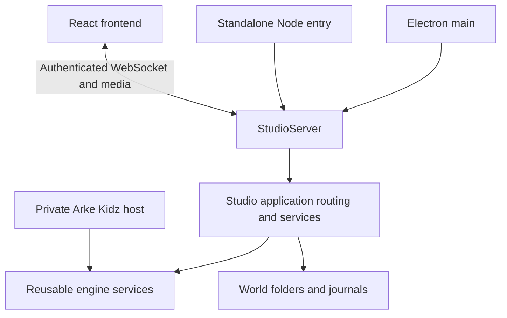

# Running Studio without Electron

The standalone Node host runs Studio's application services and the existing authenticated
WebSocket and media endpoints. The React frontend runs separately. This first host listens
on loopback and serves one local Studio session; it is not a multi-user cloud deployment.

Install Node 22.12 or newer and run `npm ci`. In one terminal, from the repository root:

```powershell
npm run server -- --root C:\ArkeData
```

The root is required. It holds settings, worlds, journals and runtime state. Startup does not
seed fixtures or reset credentials. Use a dedicated root and run only one Studio host against
it at a time. Existing world ownership checks still apply.

In a second terminal, run `npm run dev` and open the **Arke session** link it prints.
The private launch capability passes through the existing restricted local handoff file and
URL fragment. Vite does not serve that file. Restart Vite after restarting the server to obtain
the new session link. Vite checks the saved capability against the running server before printing it. If verification fails, check that both terminals use the same checkout, the endpoint port matches, and the server allows the frontend origin. The browser distinguishes a rejected session link from a server that is offline. Keep the link private.

Options:

- `--port 8791`: server port; zero chooses a free port.
- `--origin http://localhost:5173`: permitted frontend origin; repeat for more than one.
  Defaults are localhost and 127.0.0.1 on port 5173.
- `--no-harness`: start with AI explicitly disabled.

For a different server port, set `$env:VITE_ARKE_WS = "ws://127.0.0.1:8792"` before starting
the frontend. For a different frontend port, set `PORT` in that terminal and pass its exact
origin to the server. Press Ctrl+C in the server terminal to drain work and close the world.

## What works

The Node host uses the same Studio command routing, world persistence, proposal acceptance,
progress events and reconnect snapshots as desktop. The regression journey creates a Story,
creates and saves a chapter, exports and downloads a Word manuscript, reconnects, then
restarts and verifies the saved chapter. Completed Word and EPUB exports can be downloaded
from the browser's manuscript sheet through the authenticated media endpoint.

AI uses the existing configured harness and its sign-in. This launcher does not invent a
password-encryption key: persistent provider-key storage is unavailable unless an embedding
host supplies a real `Cipher`. Its separate credential filename leaves desktop and development
credentials untouched. Native file pickers, shell actions, voice and media tools require
their platform adapters; the standalone launcher does not supply them.

## Ownership



`StudioServer` owns transport authentication, listening and connection shutdown.
`createStudioHost` composes it with the Studio application. Desktop and the development
entry use that same host. `createNodeStudioHost` supplies filesystem persistence and ordinary
Node integrations. Application services retain their existing save, recovery and drain order.
The old `Coordinator.start/stop` methods remain compatibility entry points for existing consumers.
Consumers of `createStudioHost` must start and stop its `server`.

Kidz can embed the reusable engine in its own private host; it does not need to call this Studio
server. Tenant isolation, Aonik persistence, scheduling, printing, internet authentication and
distributed writer fencing remain separate work.
